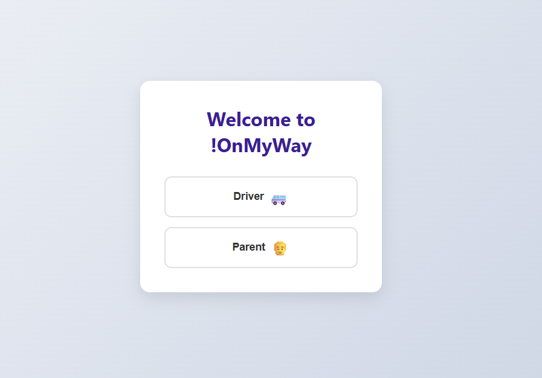
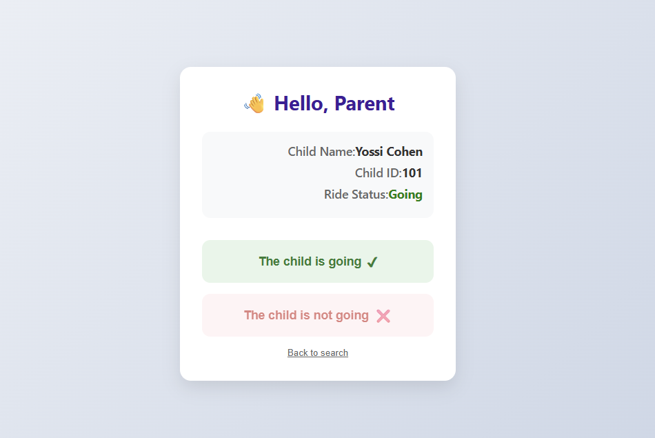
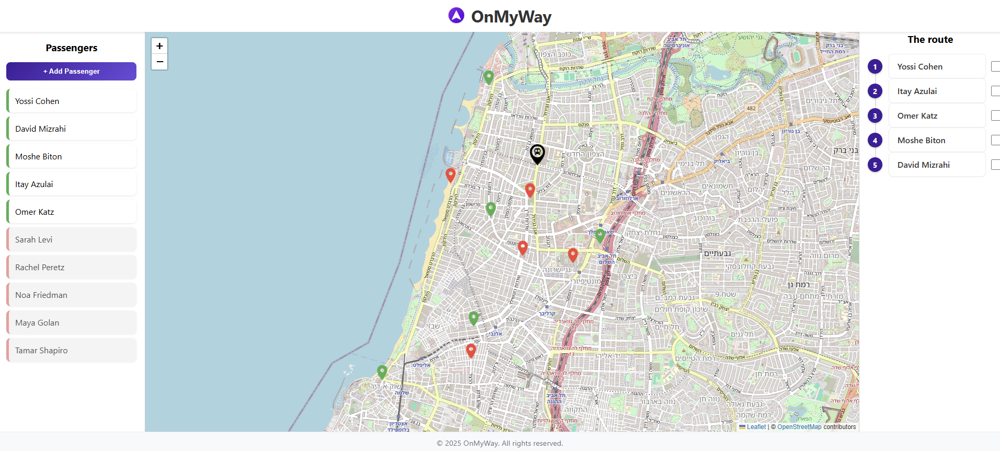

# 🚐 OnMyWay – Ride Management & Parent Confirmation System  
**Full-Stack Web Application (MVP)**

**OnMyWay** is a full-stack web application designed to help a **ride escort / driver** manage child pickups efficiently and in the correct order.

Parents confirm whether their child will participate in the ride, and the escort receives a **clear, visual platform** showing:
- Which children need to be picked up
- Their pickup locations
- The correct pickup order for the ride

The system combines parent confirmation, geolocation, and interactive map visualization.

---

## 🎯 Project Goal

The main goal of this system is to provide a **ride escort** with a reliable tool that answers two key questions:

1. **Which children should be picked up today?**
2. **In what order should they be collected?**

Parents only confirm participation, while the escort sees an aggregated and ordered route.

---

## 👥 Authors

Developed collaboratively by:

- **Noam Cohen**
- **Yair Margalit**

---

## 🧱 Tech Stack

### Frontend
- React (Vite)
- JavaScript (ES6)
- Fetch API
- **Leaflet** + **OpenStreetMap**
- CSS

### Backend
- Node.js (ES Modules)
- Express
- MySQL (mysql2)
- Axios (external API calls)
- dotenv
- Nodemon (development)

---

## 🖼️ Application Screens

### Login Screen (Role Selection)



### Parent Confirmation Screen



### Ride Escort Dashboard - main view



---

## 🗺️ Map & Visualization

The application uses **Leaflet** with **OpenStreetMap** tiles to visualize:

- Ride starting point (bus icon)
- Passenger pickup locations
- Color-coded markers:
  - 🟢 Green – Child is going
  - 🔴 Red – Child is not going
  - 🔵 Blue – Selected / highlighted passenger
- Ordered pickup route list synchronized with map markers

Passenger addresses are automatically geocoded using the **OpenStreetMap Nominatim API** when a new passenger is added.

---

## 🗄️ Database Design (MySQL)

### Tables

#### Address
- id (PK)
- x_coordinate
- y_coordinate
- full_address

#### Person
- id (PK)
- f_name
- l_name
- address_id (FK)

#### Confirmation
- id (PK)
- person_id (FK)
- status_ride (BOOLEAN)

---

## 🔌 Backend API Endpoints

- `GET /users` – Get all passengers (escort view)
- `GET /users/:id` – Get single child (parent view)
- `PUT /users/:id/status` – Update ride status
- `POST /addUser` – Add passenger
- `DELETE /deleteUser/:id` – Delete passenger
- `GET /route` – Get ordered ride route

---

## 🔐 Environment Variables (.env)

Create a `.env` file inside `Backend/`:

```
DB_HOST=localhost
DB_USER=onmyway_app
DB_PASSWORD=your_password_here
DB_NAME=onmyway
DB_PORT=3306
```

Do not commit this file to GitHub.

---

## 🛠️ Database Initialization

```
cd Backend/DB_SQL
mysql -u onmyway_app -p onmyway < schema.sql
```

---

## ▶️ Running the Project

### Backend
```
cd Backend
npm install
npm run dev
```

### Frontend
```
cd Frontend
npm install
npm run dev
```

---

## 📌 Project Status

This project is a **full-stack MVP**, built to model a real-world ride management system with parent confirmation and map-based route visualization.
